# Data Validation Agent - Architecture

**Simple. Modular. Trust-Building.**

---

## One-Slide Architecture

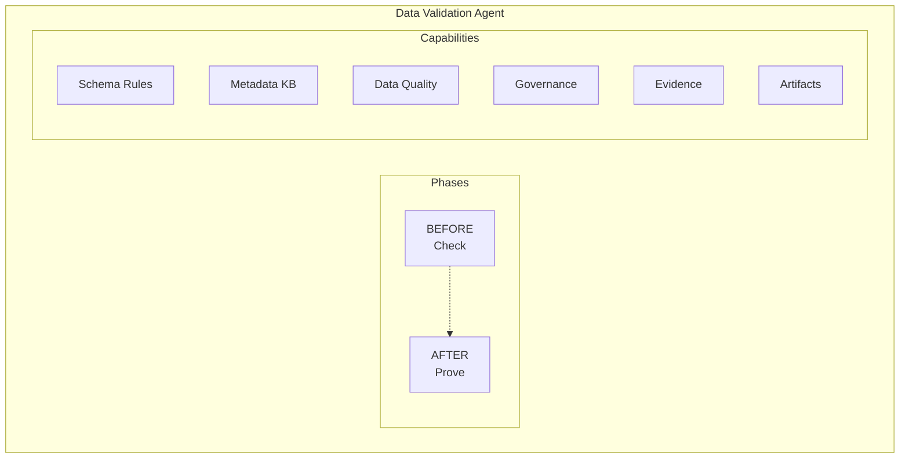

---

## Core Components

### 1. **Validation Phases** (What Users See)

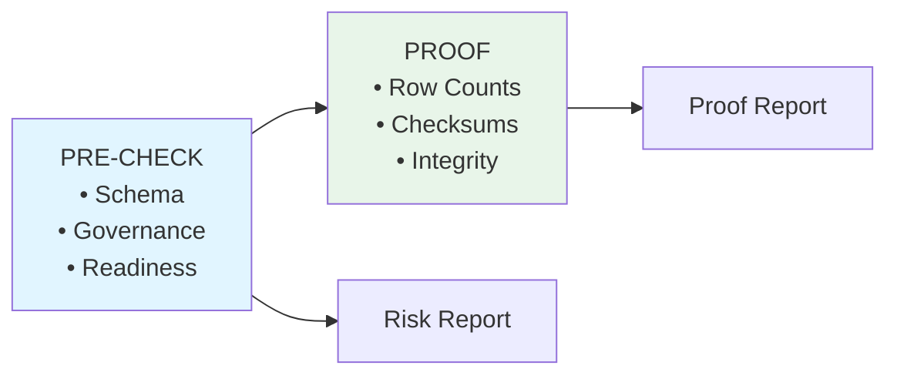

### 2. **Validation Engine** (What Happens Inside)

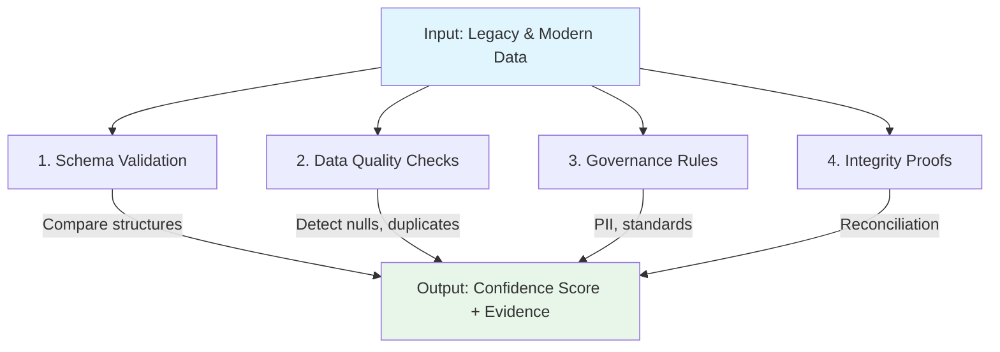

### 3. **Intelligent Reasoning** (Auto-Generated Knowledge Base)

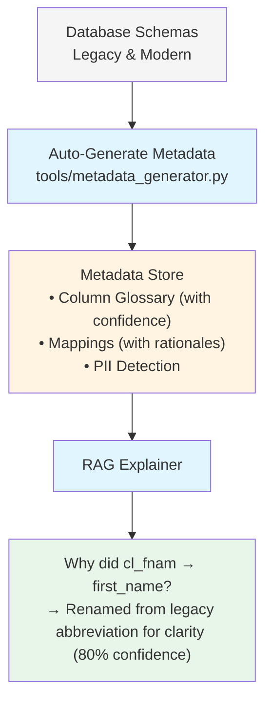

Metadata is **automatically generated** from database schemas - no manual JSON curation needed.
See [RAG_METADATA_ANALYSIS.md](RAG_METADATA_ANALYSIS.md) for details.

### 4. **Evidence Generation** (Audit Trail)

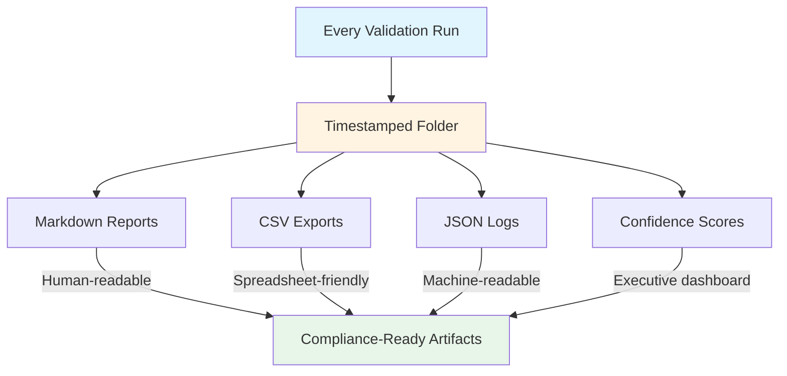

---

## Data Flow

### Pre-Migration Check

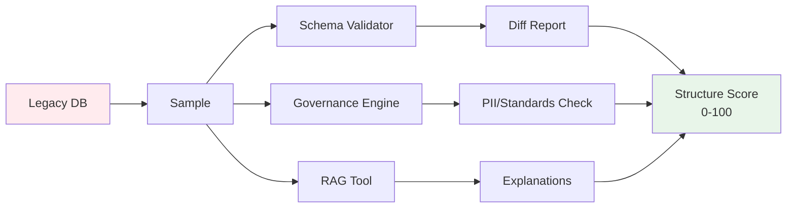

### Post-Migration Proof

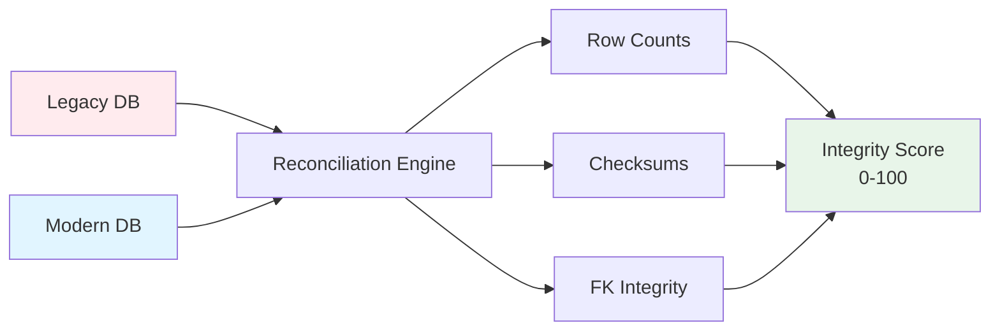

---

## Confidence Scoring Formula

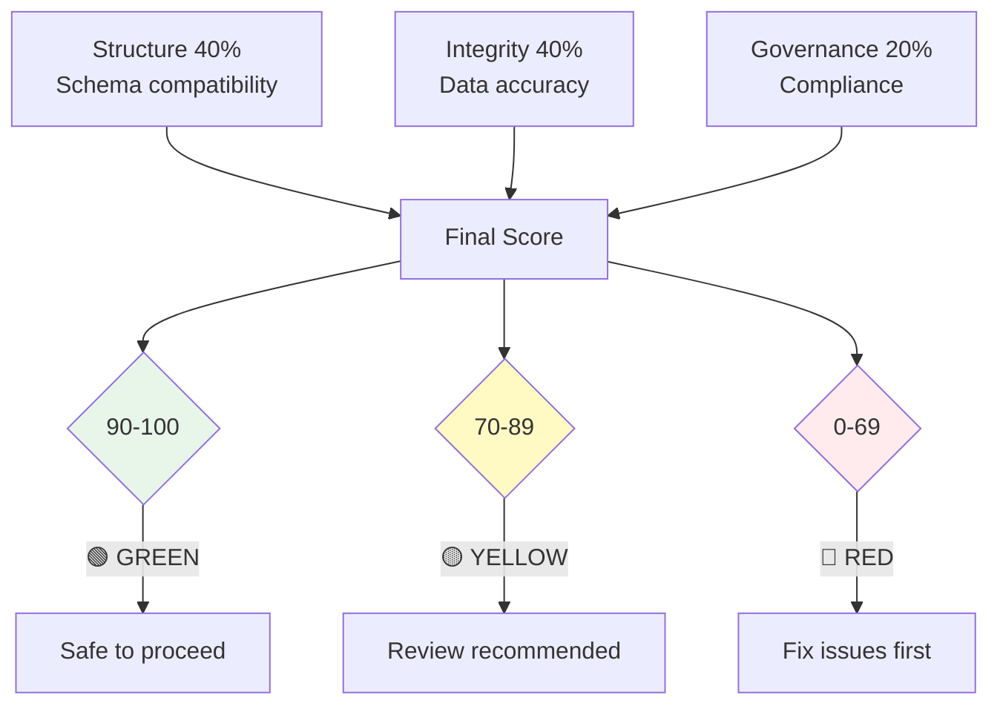

---

## Key Design Principles

### 1. **Fail-Loud, Not Silent**
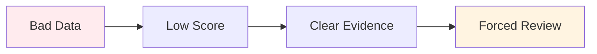
No false confidence. Issues are surfaced immediately.

### 2. **Explainable, Not Black Box**
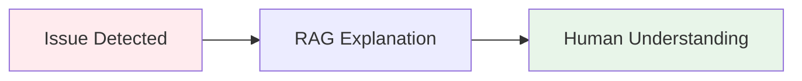
Every finding includes "why" and "what to do."

### 3. **Evidence-First**
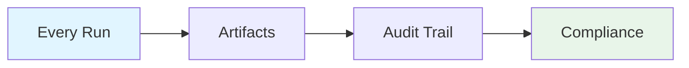
Trust through transparency.

### 4. **Modular & Extensible**
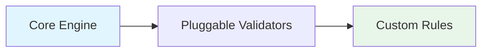
Easy to adapt for different databases and rules.

---

## Technology Mapping (For Technical Audiences)

| Stakeholder Term | Technical Implementation |
|-----------------|-------------------------|
| Schema Validation Rules | Pandera DataFrameSchemas |
| Metadata Knowledge Base | Auto-generated JSON + sentence-transformers embeddings |
| Data Quality Engine | pandas + custom validation logic |
| Governance Checks | Regex patterns + keyword matching |
| Reconciliation Engine | SQL queries + hash comparisons |
| Evidence Artifacts | Markdown + CSV + JSON generators |

---

## Integration Points

### Input
- Legacy database connection (PostgreSQL, MySQL, etc.)
- Modern database connection
- Configuration file (YAML)
- Validation schemas (auto-generated via Pandera)
- RAG metadata (auto-generated from database schemas)

### Output
- Markdown reports (human-readable)
- CSV exports (spreadsheet-compatible)
- JSON logs (API-compatible)
- Confidence scores (dashboards)

### Extension Points
- Custom validation rules (add to governance.py)
- Additional data sources (extend db_utils.py)
- Custom report formats (add to reporter.py)
- New scoring weights (modify config.yaml)

---

## Deployment Options

### Option 1: CLI (Current)
```bash
python main.py --phase pre --dataset claimants
```
**Use Case**: Manual validation, ad-hoc checks

### Option 2: CI/CD Pipeline
```yaml
# .github/workflows/migration-check.yml
- name: Validate Migration
  run: |
    python main.py --phase pre --dataset claimants
    if [ $? -ne 0 ]; then exit 1; fi
```
**Use Case**: Automated pre-deployment checks

### Option 3: API Wrapper (Future)
```python
# api.py
@app.post("/validate/{phase}")
def validate(phase: str, dataset: str):
    result = run_agent(phase, dataset)
    return result
```
**Use Case**: Integration with dashboards

---

## Performance Characteristics

- **Pre-Check**: ~30 seconds (500-1000 sample size)
- **Post-Check**: ~45 seconds
- **Total E2E**: < 2 minutes

**Scalability**: Sampling-based approach means performance is independent of total data size.

---

## Security Considerations

1. **Read-Only Operations**: Agent only reads data, never writes
2. **PII Detection**: Flags sensitive data for masking
3. **Audit Trail**: Complete log of all checks performed
4. **Credential Management**: Database credentials via config with `${VAR:default}` environment variable support

---

## Future Enhancements

### Real-Time Drift Monitoring (TODO)

The current agent validates **before** and **after** migration. A future enhancement would add **during-migration** monitoring for live drift detection. Realistic production approaches include:

- **CDC-based**: Hook into Debezium/Kafka Connect change streams to monitor rows as they are written to the modern system. Compare each batch against baseline quality metrics (null rates, duplicate rates, value distributions).
- **Polling-based**: Periodic row-count and checksum snapshots on a cron schedule (e.g., every 5 minutes). Detect sudden spikes in nulls, duplicates, or row-count divergence.
- **ETL-integrated**: Callbacks from Airflow/dbt after each batch completes. The validation agent runs a quick quality check on the latest batch and reports drift scores.
- **Alerting**: Slack/PagerDuty webhooks when drift score drops below a configurable threshold, enabling immediate human intervention.

### Other Enhancements

1. **Web Dashboard**: Visual interface for results
2. **Real-Time Alerts**: Slack/email notifications
3. **Historical Trends**: Track confidence scores over time
4. **ML-Based Anomaly Detection**: Learn normal patterns
5. **Multi-Database Support**: Oracle, SQL Server, Snowflake

---

**Architecture Philosophy:**
Keep the core simple. Make it explainable. Trust through evidence.
