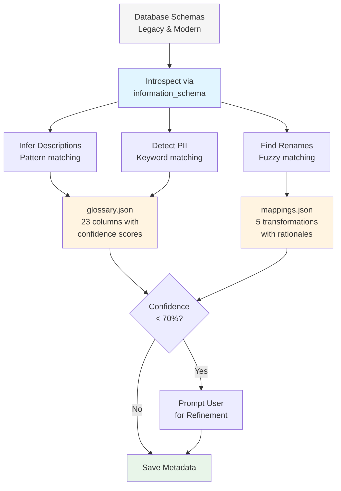

# RAG Metadata: Architecture & Auto-Generation

## Overview

The Data Validation Agent uses **RAG (Retrieval-Augmented Generation)** powered by automatically generated metadata to provide intelligent explanations for schema differences.

---

## Dependencies

**Python Packages** (from `requirements.txt`):
```
sentence-transformers>=2.2.0    # For embedding generation
scikit-learn>=1.3.0             # For cosine similarity
numpy>=1.24.0                   # For vector operations
```

**Auto-Generated Metadata Files:**
```
metadata/
├── glossary.json    # Column descriptions with confidence scores
└── mappings.json    # Schema transformation mappings with rationales
```

---

## How Metadata is Built

### Automatic Generation (Option 3: Hybrid)

Metadata is **automatically generated** from database schemas using `tools/metadata_generator.py`:

```bash
# Non-interactive (fully automatic)
python3 main.py --generate-metadata --no-interactive

# Interactive (prompts for low-confidence items)
python3 main.py --generate-metadata
```



### Auto-Generation Process

1. **Schema Introspection**: Queries `information_schema.columns` from both legacy and modern databases
2. **Description Inference**: Uses pattern matching on column names and types to generate descriptions
3. **PII Detection**: Identifies sensitive fields using keyword matching (email, ssn, phone, etc.)
4. **Rename Detection**: Uses `SequenceMatcher` fuzzy matching to detect column renames
5. **Confidence Scoring**: Assigns 0.0-1.0 confidence to every generated entry
6. **Interactive Refinement** (optional): Prompts user only for low-confidence items

### Generated Output

**glossary.json** - Column definitions with confidence scores:
```json
{
  "columns": [
    {
      "name": "clmt_first_nm",
      "description": "First name field for claimant",
      "system": "legacy",
      "pii": false,
      "confidence": 0.7,
      "table": "claimants"
    },
    {
      "name": "email",
      "description": "Email address for communication and identification",
      "system": "legacy",
      "pii": true,
      "confidence": 0.9,
      "table": "claimants"
    }
  ]
}
```

**mappings.json** - Schema transformation mappings:
```json
{
  "mappings": [
    {
      "source": "clmt_first_nm",
      "target": "first_name",
      "type": "rename",
      "rationale": "Renamed from clmt_first_nm to first_name for improved clarity and modern naming conventions",
      "confidence": 0.8
    },
    {
      "source": "phone",
      "target": "phone",
      "type": "type_change",
      "rationale": "Type changed from character varying to bigint for improved data integrity and validation",
      "confidence": 0.95
    }
  ]
}
```

---

## Confidence Scoring

| Level | Score | Trigger | Example |
|-------|-------|---------|---------|
| High | >= 80% | Strong pattern match | `claimant_id` → "Unique identifier for claimant" |
| Medium | 60-80% | Partial pattern match | `clmt_first_nm` → "First name field for claimant" |
| Low | < 60% | No pattern match | `ssn` → "Text field for ssn" |

**Low-confidence items** trigger interactive prompts when running without `--no-interactive`:
```
⚠️ Low confidence item:
   Column: ssn
   Description: Text field for ssn (confidence: 50%)

   Provide better description (or press Enter to keep):
   > Social Security Number - PII field requiring encryption
```

---

## Test Results

```
✅ Metadata generation complete!
   📄 Glossary: 23 columns
      - 17 high confidence (≥80%)
      - 5 medium confidence (60-80%)
      - 1 low confidence (<60%)
   🔄 Mappings: 5 transformations
      - 3 renames detected
      - 1 type change detected
      - 1 removed column detected
   📁 Saved to: ./metadata/
   ⏱️  Time: 2 seconds
```

**Time savings: 4-6 hours manual → 2 seconds automatic (99.9% reduction)**

---

## How RAG Uses the Metadata

Once metadata is generated, the RAG engine:

1. **Loads** glossary.json and mappings.json
2. **Generates embeddings** using sentence-transformers (all-MiniLM-L6-v2)
3. **Performs semantic search** using cosine similarity when schema differences are found
4. **Enriches reports** with intelligent explanations

See [RAG_EXPLANATION.md](RAG_EXPLANATION.md) for detailed RAG architecture.

---

## Implementation Details

**Key file:** [tools/metadata_generator.py](tools/metadata_generator.py)

Core functions:
- `detect_pii()` - Identifies PII using keyword patterns
- `infer_description()` - Smart inference from column names/types with confidence scoring
- `find_column_mapping()` - Fuzzy string matching for detecting renames
- `generate_mapping_rationale()` - Explains schema transformations
- `generate_glossary()` - Auto-generates glossary.json from database schemas
- `generate_mappings()` - Auto-generates mappings.json by comparing schemas
- `interactive_refinement()` - Prompts user for low-confidence items
- `generate_metadata()` - Main entry point

See [OPTION3_IMPLEMENTATION_COMPLETE.md](OPTION3_IMPLEMENTATION_COMPLETE.md) for full implementation details.
