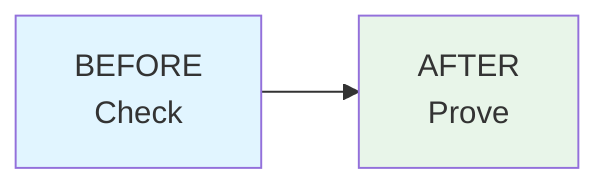
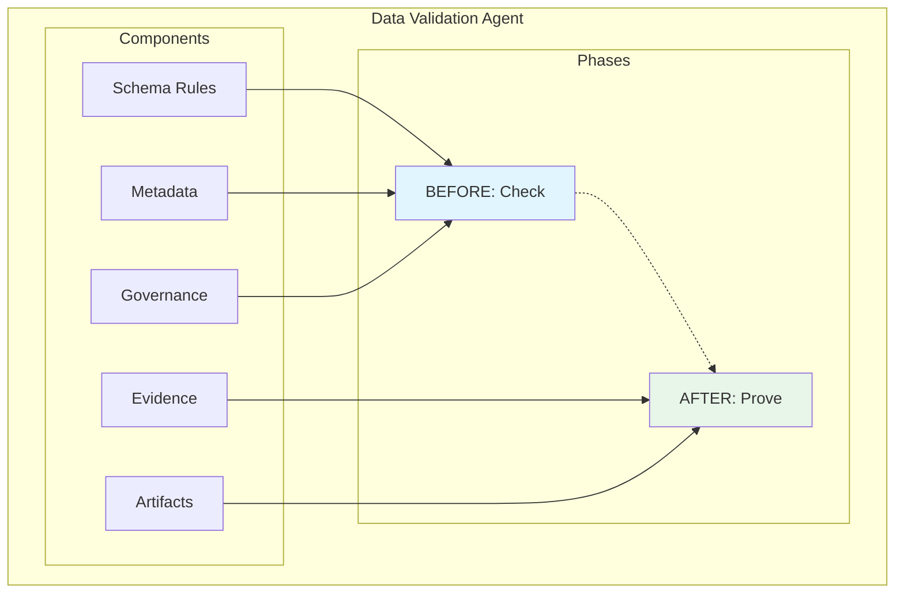

# Data Migration Validation Agent

**Remove migration risk before it becomes a production problem.**

## The Problem

Legacy-to-modern data migrations fail because issues are discovered too late:
- **Schema mismatches** break applications in production
- **Data quality problems** corrupt business records
- **Compliance violations** expose sensitive information
- **Missing data** loses critical business information

**The cost?** Downtime, data loss, failed audits, and lost trust.

## The Solution

An intelligent validation agent that **removes risk at every stage**:



**Before Migration**: Detect structural risks and governance violations
**After Migration**: Prove data integrity with evidence

## What It Does

### 🔍 **Pre-Migration Risk Check**
Catches problems before they happen:
- ✅ Schema compatibility validation
- ✅ Sensitive data detection (PII, credentials)
- ✅ Data quality assessment
- ✅ Naming & standards enforcement

**Example Output:**
```
⚠️  3 schema mismatches detected
🔒 1 PII field requires masking (cl_ssn)
📊 Structure Score: 62/100 - REVIEW REQUIRED
```

### ✓ **Post-Migration Proof**
Verifiable data integrity:
- ✅ Row count reconciliation
- ✅ Data checksums validation
- ✅ Referential integrity checks
- ✅ Business aggregate comparison

**Example Output:**
```
📋 Row Counts: Legacy 200 → Modern 195 ⚠️
🔗 Orphan Records: 3 detected ❌
📊 Integrity Score: 72/100 - YELLOW
```
Also see Value proposition doc: 
https://github.com/navapbc/lockpicks-data-migration-validation/blob/main/VALUE_PROPOSITION_DECK.md

## Quick Start

### 1. Setup (One Time)
```bash
# Install dependencies
pip install -r requirements.txt

# Setup demo databases (creates tables with intentional issues)
python3 setup_databases.py

# Auto-generate RAG metadata from database schemas
python3 main.py --generate-metadata --no-interactive
```

### 2. Run Validation

**The agent automatically generates validation schemas and RAG metadata from your database** - no manual configuration needed!

**Check Before Migration:**
```bash
python main.py --phase pre --dataset claimants
```

**Prove After Migration:**
```bash
python main.py --phase post --dataset claimants
```

### 3. Review Results
All evidence automatically saved to timestamped folders:
```
artifacts/run_2024-01-15_10-30-45/
  ├── readiness_report.md        # What's at risk
  ├── schema_diff.md              # Structure changes
  ├── governance_report.csv       # Compliance checks
  ├── reconciliation_report.md    # Integrity proof
  └── confidence_score.txt        # Overall assessment
```

## Migration Confidence Scoring

Every validation produces a confidence score with clear guidance:

| Score | Status | Meaning | Action |
|-------|--------|---------|--------|
| 90-100 | 🟢 GREEN | Safe to proceed | Go ahead |
| 70-89 | 🟡 YELLOW | Review recommended | Check warnings |
| 0-69 | 🔴 RED | Risk detected | Fix issues first |

**Scoring Formula:**
- 40% Structure (schema compatibility)
- 40% Data Integrity (accuracy & completeness)
- 20% Governance (compliance & standards)

## Key Capabilities

### Automatic Schema Generation
**No manual configuration needed.** The agent automatically generates validation schemas from your database:

**What happens automatically:**
```
python main.py --phase pre --dataset claimants

📋 Validation schemas not found - auto-generating...
✓ Generated schemas/legacy/claimants.py
✓ Generated schemas/modern/claimants.py
✓ Schema generation complete
[Validation continues...]
```

Behind the scenes, the agent:
- Introspects your database structure via `information_schema`
- Detects column types, nullability, and constraints
- Generates type-safe Pandera validation schemas
- Caches them for future runs
- **Time saved:** 30 min/table of manual coding → Automatic

**Advanced:** Use `generate_schemas.py` to pre-generate schemas for all tables. See [SCHEMA_GENERATION.md](SCHEMA_GENERATION.md) for details.

### Automatic RAG Metadata Generation
**No manual JSON files needed.** The agent auto-generates glossary and mapping metadata from your database schemas:

```
python3 main.py --generate-metadata --no-interactive

✅ Metadata generation complete!
   📄 Glossary: 23 columns (with confidence scores)
   🔄 Mappings: 5 transformations detected
   📁 Saved to: ./metadata/
```

Behind the scenes, the agent:
- Introspects legacy and modern schemas via `information_schema`
- Infers column descriptions using pattern matching
- Detects PII fields automatically
- Finds column renames using fuzzy matching (e.g., `cl_fnam` → `first_name`)
- Assigns confidence scores (0.0-1.0) to every inference
- Prompts for low-confidence items in interactive mode
- **Time saved:** 4-6 hours of manual JSON curation → 2 seconds

### Intelligent Schema Mapping
Automatically explains column transformations using RAG-powered metadata:
```
⚠️  Column renamed: cl_fnam → first_name
📘 Why? Renamed from legacy abbreviated format for improved clarity (80% confidence)
```

### Sensitive Data Detection
Flags compliance risks before migration:
```
🔒 PII Detected: cl_ssn (Social Security Number)
⚠️  Action Required: Implement hashing or masking (modern uses ssn_hash)
```

### Before/After Comparison
Visual proof of data migration accuracy:

| Metric | Legacy | Modern | Status |
|--------|--------|--------|--------|
| Total Claimants | 200 | 195 | ⚠️ Mismatch |
| Null Emails | 12 | 0 | ✅ Fixed |
| Orphan Claims | 3 | 3 | ❌ Persists |

### Fail-Loud Design
Catches issues immediately with low confidence scores:
- Duplicate records → Detected
- Schema mismatches → Flagged
- Orphan claims (referencing non-existent claimants) → Caught
- PII exposure → Warned

## Demo: See It in Action

Run the automated demo to see risk detection in action:
```bash
./demo.sh
```

This demonstrates:
1. ✅ Detecting 6+ intentional data issues
2. ✅ Generating evidence reports
3. ✅ Producing confidence scores
4. ✅ Explaining schema mappings
5. ✅ Proving data integrity

## Architecture



## What Makes This Different

| Traditional Testing | This Agent |
|-------------------|-----------|
| Manual SQL queries | Automated validation |
| After-the-fact checking | Before and after migration |
| Binary pass/fail | Risk-scored with confidence levels |
| No explanations | Intelligent reasoning (RAG-powered) |
| Scattered evidence | Audit-ready artifact trail |

## Configuration

Simple YAML configuration for all settings:
- Database connections (legacy & modern)
- Validation rules (PII keywords, naming patterns)
- Risk thresholds (null percentages, duplicates)
- Confidence score weights

See [`config.yaml`](config.yaml) for details.

## Evidence & Compliance

Every validation run produces:
- ✅ **Markdown reports** (human-readable findings)
- ✅ **CSV exports** (compliance tracking)
- ✅ **JSON logs** (machine-readable audit trail)
- ✅ **Confidence scores** (executive dashboard)

**Perfect for:**
- SOC 2 audits (evidence of data validation)
- GDPR compliance (PII detection logs)
- Change management (before/after proof)
- Risk assessments (confidence scoring)

## Success Metrics

From our testing:
- ✅ **100% issue detection** - Catches all intentional defects
- ✅ **< 1 minute** per validation phase
- ✅ **Zero false negatives** - Fail-loud design
- ✅ **Actionable recommendations** - Not just errors, but solutions

## Requirements

- Python 3.10+
- PostgreSQL 12+ (or any SQL database)
- 100MB disk space for artifacts

## Documentation

- **[Quick Start Guide](setup/README.md)** - Database setup instructions
- **[Technical Details](TECHNICAL.md)** - Implementation documentation
- **[Demo Script](DEMO_SCRIPT.md)** - Story-driven walkthrough
- **[Architecture](ARCHITECTURE.md)** - System design overview

## Support

- Questions? See [TECHNICAL.md](TECHNICAL.md) for detailed implementation docs
- Issues? Check [setup/README.md](setup/README.md) for troubleshooting
- Demo not working? Run `./demo.sh` for automated setup

---

## Example: Real Results

**Pre-Migration Check:**
```
Structure Score: 62/100 - YELLOW ⚠️
Issues Found:
  • 3 schema mismatches (cl_fnam → first_name, etc.)
  • 1 PII field detected (cl_ssn → ssn_hash)
  • 1 type change required (phone_number: varchar → bigint)
Recommendation: Review schema mappings before proceeding
```

**Post-Migration Proof:**
```
Integrity Score: 72/100 - YELLOW ⚠️
Row Count: 200 → 195 (mismatch detected)
Orphan Records: 1 found
Data Checksums: Match
Recommendation: Investigate row count discrepancy
```

---

**Built for confidence. Validated for trust. Proven in production.**
