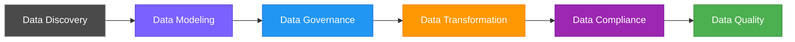
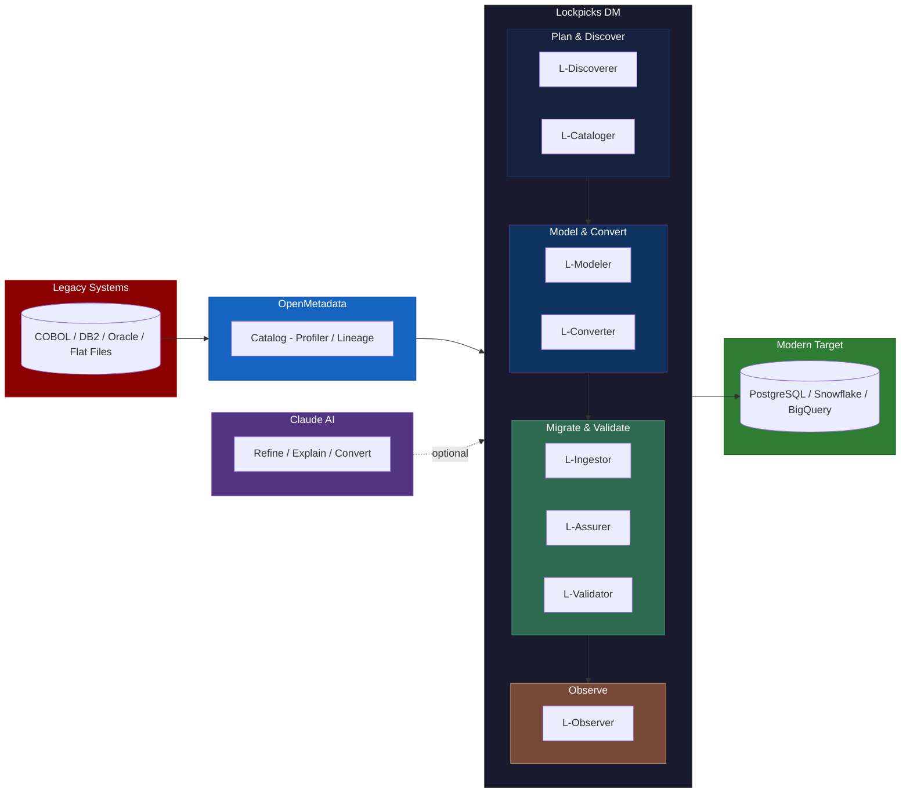

# Lockpicks Data Migration

Data migration is a crucial, but delicate, step in transitioning away from a legacy system towards a modern system. In spite of various industry tooling around data migration, legacy to modern system data migration initiatives are quite complex and leave stakeholders involved with key questions:

- **How might we create higher confidence and trust** in our data migration process or approach?
- **How might we reduce risks** around data compliance and impacts to project timelines?
- **How might we create transparency** in the process, especially for non-technical stakeholders?

---

## Solution: Lockpicks Data Migration

Lockpicks Data Migration is an open, full-lifecycle toolkit that covers every phase of data migration -- from legacy rationalization through post-migration observability. It integrates **[OpenMetadata](https://open-metadata.org/)** as the metadata backbone and **[Claude AI](https://claude.ai)** as an intelligent co-pilot, while keeping every step auditable, deterministic-first, and pluggable.

Unlike proprietary migration suites, Lockpicks is built on open standards (OpenMetadata, pluggy hooks) and follows a **deterministic-first, AI-second** principle: rule engines produce complete, working output at every stage; AI refines but is never required. Every phase produces auditable artifacts and a quantified 0-100 confidence score.

---

## Data Migration Lifecycle



Each lifecycle phase maps to industry tooling (OpenMetadata) and Lockpicks DM tools:

- **Data Discovery** -- Collect legacy data sources, schemas, glossary. Identify data worth migrating vs. dark data to archive. (OpenMetadata catalog, profiling, lineage, PII auto-tagging)
- **Data Modeling** -- Normalized schema design from denormalized legacy tables, informed by profiling data and domain requirements.
- **Data Governance** -- PII/PHI detection (45+ patterns including COBOL abbreviations), data modification controls (`rename`, `transform`, `archived`, `removed`), audit trails via timestamped artifact folders.
- **Data Transformation** -- Legacy SQL/ETL code conversion to modern platform code, metadata-driven migration orchestration with dependency ordering.
- **Data Compliance** -- Pre-migration PII exposure detection, archived field leakage gates (PCI/HIPAA), profile-based risk assessment.
- **Data Quality** -- Source-vs-target reconciliation: row counts, checksums, FK integrity, sample comparison, business aggregates, encoding validation, post-migration drift monitoring.

---

## Component Model



---

## Tool Suite

| Phase | Tool | CLI | What It Does |
|-------|------|-----|-------------|
| Plan | **L-Discoverer** | `dm rationalize` | Scores table relevance from OM catalog, identifies dark data, recommends migration scope |
| Discover | **L-Cataloger** | `dm discover --enrich` | Pulls OM profiling, glossary, PII tags, lineage into enriched glossary |
| Model | **L-Modeler** | `dm generate-schema` | Normalization analysis + DDL generation with type optimization and PII handling |
| Convert | **L-Converter** | `dm convert` | Translates legacy SQL/ETL to modern target code (rule engine + Claude AI) |
| Migrate | **L-Ingestor** | `dm ingest` | Dependency-ordered migration orchestration with state tracking |
| Pre-check | **L-Assurer** | `dm validate --phase pre` | Pre-migration structural, governance, and profiling risk checks |
| Post-check | **L-Validator** | `dm validate --phase post` | Post-migration source-vs-target reconciliation |
| Monitor | **L-Observer** | `dm observe` | Pipeline drift detection, volume anomalies, schema changes |

---

## Quick Start: Bootstrap a New Project

### 1. Install

```bash
uv sync                            # Core toolkit
uv sync --extra ai                 # + Claude AI integration
uv sync --extra dashboard          # + Streamlit dashboard
uv sync --extra ai --extra dashboard  # Both extras
uv sync --all-extras               # Everything
```

### 2. Prerequisites

- [uv](https://docs.astral.sh/uv/) (recommended) or pip
- Python 3.11+
- OpenMetadata running (default: `http://localhost:8585`)
- Legacy data source accessible to OpenMetadata (DB2, Oracle, PostgreSQL, etc.)
- Target PostgreSQL database

### 3. Scaffold a project

```bash
dm init my-migration
```

Creates:

```
projects/my-migration/
  project.yaml              # Connections, datasets, validation rules, OM config
  metadata/                 # Auto-generated glossary + mappings
  plugins/
    __init__.py
    my_plugin.py            # Your domain-specific hooks
  schemas/                  # Auto-generated Pandera validation schemas
    legacy/
    modern/
  artifacts/                # Timestamped validation run outputs
```

### 4. Configure project.yaml

Edit `projects/my-migration/project.yaml`:

```yaml
project:
  name: "My Migration"
  description: "Legacy to modern migration"
  version: "1.0"

connections:
  legacy:
    type: postgres
    host: ${DB_LEGACY_HOST:localhost}
    port: 5432
    database: ${DB_LEGACY_NAME:legacy_db}
    user: ${DB_LEGACY_USER:postgres}
    password: ${DB_LEGACY_PASSWORD:postgres}
  modern:
    type: postgres
    host: ${DB_MODERN_HOST:localhost}
    port: 5432
    database: ${DB_MODERN_NAME:modern_db}
    user: ${DB_MODERN_USER:postgres}
    password: ${DB_MODERN_PASSWORD:postgres}

datasets:
  - name: customers
    legacy_table: cust_master
    modern_table: customers
    primary_key: cust_id
    modern_key: customer_id

# OpenMetadata integration
openmetadata:
  host: ${OM_HOST:http://localhost:8585}
  auth_token: ${OM_AUTH_TOKEN:}
  legacy_service: "my-legacy-service"    # Must match OM service name
  legacy_database: "my_database"
  legacy_schema: "public"

# Schema generation settings
schema_generation:
  target: postgres
  naming_convention: snake_case
  abbreviation_expansion: true
  type_optimization: true
  pii_handling:
    default_action: hash
  normalization:
    enabled: true
    min_group_size: 3
    prefix_detection: true
    lookup_threshold: 20
  constraints:
    infer_not_null: true
    infer_unique: true
    infer_check: true
  defaults:
    add_created_at: true
    add_updated_at: true
    id_strategy: serial

# AI configuration (optional)
ai:
  provider: anthropic                    # anthropic | manual
  api_key: ${ANTHROPIC_API_KEY:}
  model: claude-sonnet-4-6-20250514

validation:
  sample_size: 1000
  governance:
    pii_keywords: [ssn, email, phone, dob, credit_card, account_number]
    naming_regex: "^[a-z0-9_]+$"
    max_null_percent: 10

scoring:
  weights:
    structure: 0.4
    integrity: 0.4
    governance: 0.2
  thresholds:
    green: 90
    yellow: 70

plugins: []

artifacts:
  base_path: ./artifacts
```

Environment variables use `${VAR:default}` syntax.

### 5. Run the pipeline

#### Phase 1: Rationalize — what's worth migrating?

```bash
dm rationalize -p projects/my-migration
```

Invokes `MigrationRationalizer` which connects to OpenMetadata and scores each table on five weighted dimensions: **query activity** (35%) via log-scale scoring on query count, **downstream lineage** (25%) counting unique consumers, **freshness** (20%) inverse age of last profile, **completeness** (10%) inverse average null percentage, and **data tier** (10%) from OM tier ratings. Each table gets a 0-100 relevance score and is classified as **Migrate** (>=70), **Review** (40-69), or **Archive** (<40). Plugin overrides can force-include or force-exclude tables via the `dm_rationalization_overrides` hook.

**Outputs:** `rationalization_report.md`, `rationalization_report.json`, `migration_scope.yaml` (tables grouped by classification).

---

#### Phase 2: Discover — pull enriched metadata from OM

```bash
dm discover --enrich -p projects/my-migration
```

Connects to OpenMetadata via REST API (`/tables/name/{fqn}`) to fetch schema, column profiling stats, glossary terms, PII tags, and lineage for each table. For each column: detects PII via keyword matching against configured patterns, infers descriptions via pattern matching (`_id` -> identifier, `_dt` -> date field), and fuzzy-matches legacy-to-modern columns using `SequenceMatcher` (threshold 0.7). OM-backed entries get confidence 1.0; pattern-inferred entries get 0.3. Plugin overrides apply via `dm_get_column_overrides` hook.

**Outputs:** `metadata/glossary.json` (column-level metadata with descriptions, PII flags, confidence scores), `metadata/mappings.json` (source-to-target column mappings with type: rename/transform/archived/removed).

---

#### Phase 3: Generate — normalized target schema

```bash
dm generate-schema --all -p projects/my-migration
```

Two-stage process. **Stage 1 — Normalization Analysis** (`NormalizationAnalyzer`): detects column groups via prefix matching (configurable `min_group_size`, default 3), identifies lookup tables where cardinality < `lookup_threshold` (default 20), detects address/contact patterns, and infers primary keys from `_recid`/`_id`/`_pk` suffixes. Produces a `NormalizationPlan` mapping source table to proposed entities (primary/child/lookup) with relationships and confidence scores. **Stage 2 — Schema Generation** (`SchemaGenerator`): expands COBOL abbreviations (`fnam` -> `first_name`, `dob` -> `date_of_birth`), maps legacy types to PostgreSQL, applies PII handling rules (SSN -> SHA-256 hash, bank accounts -> archive, email -> encrypt annotation), infers constraints (NOT NULL, UNIQUE, CHECK) from profiling stats, and optionally adds `created_at`/`updated_at` defaults.

**Outputs:** `artifacts/generated_schema/full_schema.sql` (combined DDL), per-table `.sql` files, `{table}_transforms.sql` (ETL transform skeletons), `metadata/normalization_plan.json`.

---

#### Phase 4: Convert — translate legacy transforms to modern SQL

```bash
dm convert --source artifacts/generated_schema/ --target postgres -p projects/my-migration
```

Three-pass code translation. **Pass 1 — Rule Engine** (`SQLRuleEngine`): auto-detects source dialect from syntax heuristics (NVL/SYSDATE -> Oracle, GETDATE/ISNULL -> MSSQL), parses SQL via `sqlglot` AST transpilation, then applies regex fallback rules for patterns sqlglot can't handle (e.g., `DECODE(a,b,c,d)` -> `CASE WHEN a=b THEN c ELSE d END`, `ROWNUM` -> `ROW_NUMBER() OVER()`, `NVL` -> `COALESCE`). Covers ~80% of conversions deterministically. **Pass 2 — AI Refinement** (optional, `--ai-refine`): sends source + translated SQL to Claude API for semantic review, performance optimization, and edge case handling. Falls back to generating a `*_prompt.md` file for manual Claude review if SDK unavailable. **Pass 3 — Plugin Overrides**: applies `dm_conversion_overrides` hook for domain-specific patches.

**Outputs:** `artifacts/converted/{table}.sql` (translated SQL), `artifacts/converted/{table}_prompt.md` (Claude prompt if AI unavailable), warnings list for ambiguous patterns.

---

#### Phase 5: Review — human reviews DDL, optionally refine with Claude

```bash
# Open artifacts/generated_schema/full_schema.sql, review, adjust
```

---

#### Phase 6: Pre-validate — is the migration safe?

```bash
dm validate --phase pre -d customers -p projects/my-migration
```

Samples `sample_size` rows (default 1000) from the legacy table and runs 6 validators in sequence. **SchemaDiffValidator**: compares legacy vs. modern schemas, penalizes removed columns (4 pts each) and type mismatches (5 pts each). **PanderaValidator**: validates column types and constraints via auto-generated Pandera schemas. **GovernanceValidator**: checks PII exposure (5 pts each, capped at 30), naming convention violations (2 pts, capped at 10), missing required fields (10 pts, capped at 30), and null threshold breaches (3 pts, capped at 15). **DataQualityValidator**: runs plugin-provided cross-field anomaly rules via `dm_data_quality_rules` hook (advisory, no penalty). **ProfileRiskValidator**: flags suspicious distribution patterns from OM profiling. **ETLTestValidator**: validates ETL transform rules defined in project config. Scoring: `confidence = (0.4 x structure) + (0.4 x integrity) + (0.2 x governance)`, mapped to GREEN (>=90), YELLOW (>=70), RED (<70). Plugin validators added via `dm_pre_validators` hook; scores adjusted via `dm_adjust_score`.

**Outputs:** `artifacts/{run_id}/readiness_report.md` (per-validator results with PASS/WARN/FAIL), `confidence_score.txt`, `run_metadata.json`.

---

#### Phase 7: Ingest — execute migration

```bash
dm ingest --plan -p projects/my-migration    # preview execution plan
dm ingest --execute -p projects/my-migration  # run migration
```

**Planning** (`MigrationPlanner`): builds a dependency graph from FK relationships and normalization plan, then topologically sorts tables via Kahn's algorithm (parents before children, cycle detection). Assigns per-table strategies: `full_load` (truncate + INSERT INTO...SELECT, default for tables <1M rows), `incremental` (timestamp-based WHERE clause), `cdc` (change data capture via OM logs), or `external` (delegate to Airbyte/dbt). Strategies overridable via `dm_ingest_strategy` hook. **Execution** (`MigrationExecutor`): processes tables in dependency order, tracks state in `migration_state.yaml` (pending/in_progress/completed/failed) with checkpoints for resume-on-failure (`--resume` skips completed tables). Invokes `dm_post_ingest` hook after each table.

**Outputs:** `artifacts/migration_state.yaml` (per-table state with checkpoints), summary with completed/failed/pending counts and total rows migrated.

---

#### Phase 8: Post-validate — did the data survive?

```bash
dm validate --phase post -d customers -p projects/my-migration
```

Runs 9 validators against source and target databases. **RowCountValidator**: legacy count == modern count; penalty = min(diff%, 30). **ChecksumValidator**: column-level MD5 comparison on comparable columns (skips archived/transformed). **ReferentialIntegrityValidator**: validates FK constraints, auto-generates from normalization plan if not configured. **SampleCompareValidator**: draws random sample, matches records by key, compares field values with format-aware tolerance (Y/N -> bool, date normalization, numeric epsilon). **AggregateValidator**: compares SUM/COUNT/AVG aggregates configured in project.yaml with configurable tolerance. **ArchivedLeakageValidator**: verifies PCI/HIPAA-archived columns contain no data in modern schema. **UnmappedColumnsValidator**: ensures all modern columns have source mappings or are auto-generated. **NormalizationIntegrityValidator**: validates child tables have no orphaned FKs and all parent PKs are present. **EncodingValidator**: detects encoding mismatches and mojibake (EBCDIC -> UTF-8). Scoring: `integrity_score = 100 - sum(penalties)`, mapped to traffic light status. Plugin validators via `dm_post_validators`; aggregates via `dm_custom_aggregates`.

**Outputs:** `artifacts/{run_id}/reconciliation_report.md`, `confidence_score.txt`, `run_metadata.json`.

---

#### Phase 9: Prove — generate audit package

```bash
dm prove -d customers -p projects/my-migration
```

Locates the latest pre-validation and post-validation run metadata for the given dataset from the artifacts directory. Retrieves both scores, computes `final_score = (pre_score + post_score) / 2`, and maps to traffic light status (GREEN >= 90, YELLOW >= 70, RED < 70). Merges pre and post reports into a unified proof document suitable for audit review.

**Outputs:** `artifacts/{run_id}/proof_report.md` (combined pre + post + final assessment with evidence links), `run_metadata.json` (phase="prove", pre_score, post_score, final_score, status).

---

#### Phase 10: Observe — monitor ongoing health

```bash
dm observe --set-baseline -p projects/my-migration   # capture baseline snapshot
dm observe --once -p projects/my-migration            # run one observation cycle
```

**Baseline capture** (`--set-baseline`): snapshots current DB state (row counts, column checksums, schema structure) via `BaselineManager` into `observer/baseline.yaml`. **Observation cycle** (`PipelineObserver.run_once()`): runs four built-in drift checks: **schema drift** (DDL column additions/removals/type changes), **volume anomaly** (row count deviation > `volume_threshold`, default 30% from 7-day moving average), **freshness** (tables not updated within `freshness_hours`, default 24), and **FK integrity** (referential constraint violations). Plugin checks added via `dm_observer_checks` hook. Compares results against baseline, dispatches alerts to configured channels (log file, Slack webhook, email), and invokes `dm_on_drift_detected` hook for custom remediation. Maintains observation history log with timestamps and drift counts.

**Outputs:** `observer/baseline.yaml` (baseline snapshot), `observer/observation_history.json` (timestamped log of all runs with drift counts), alerts dispatched to configured channels.

---

## LOOPS NJ POC: Full Walkthrough

This section walks through the complete toolkit using the reference implementation -- the **LOOPS NJ** system (NJ Department of Labor Unemployment Insurance, legacy COBOL/DB2).

Use this walkthrough to understand every phase before starting your own project.

### POC Overview

| Table | Legacy Columns | Example Fields | Description |
|-------|---------------|----------------|-------------|
| `claimants` | 17 cols | `cl_recid`, `cl_fnam`, `cl_ssn`, `cl_bact` | UI claimant records |
| `employers` | 8 cols | `er_recid`, `er_name`, `er_ein` | Employer records |
| `claims` | 10 cols | `cm_recid`, `cm_clmnt`, `cm_wkamt` | Unemployment claims |
| `benefit_payments` | 7 cols | `bp_recid`, `bp_payam`, `bp_clmid` | Weekly benefit payments |

### Step 1: Start LOOPS NJ Legacy Database

```bash
# Option A: DB2 via Docker
docker run -d --name loops-db2 --privileged -p 50000:50000 \
  -e LICENSE=accept -e DB2INST1_PASSWORD=loops_legacy -e DBNAME=LOOPSDB \
  ibmcom/db2:latest

# Wait for initialization (~2 min), then load data
docker cp setup/create_databases.sql loops-db2:/tmp/
docker exec -it loops-db2 bash -c "su - db2inst1 -c 'db2 -tvf /tmp/create_databases.sql'"

# Option B: PostgreSQL (simpler — uses existing setup scripts)
psql -U postgres -f setup/create_databases.sql
psql -U postgres -d legacy_db -f setup/load_legacy_data.sql
psql -U postgres -d modern_db -f setup/load_modern_data.sql
```

### Step 2: Configure OpenMetadata

With OM running on `http://localhost:8585`:

**2a. Create Database Service:**
Settings > Services > Databases > Add New Service

| Field | Value |
|-------|-------|
| Service Type | Db2 (or PostgreSQL) |
| Service Name | `loops-legacy` |
| Host | `localhost` |
| Port | `50000` (DB2) or `5432` (PostgreSQL) |
| Database | `LOOPSDB` / `legacy_db` |

**2b. Run Metadata Ingestion:** Services > loops-legacy > Add Ingestion > Metadata Ingestion > Deploy

**2c. Run Profiler:** Services > loops-legacy > Add Ingestion > Profiler Ingestion > Deploy (computes null%, unique%, distinct count, min/max, histograms per column)

**2d. Curate Glossary:** Glossary > Create "LOOPS Legacy" > Add terms:

| Term | Description | Linked Column |
|------|-------------|---------------|
| Claimant First Name | Legal first name | `claimants.cl_fnam` |
| Social Security Number | SSN - HIPAA regulated | `claimants.cl_ssn` |
| Bank Account Number | Direct deposit account | `claimants.cl_bact` |
| Weekly Benefit Amount | Weekly UI payment in USD | `claims.cm_wkamt` |

**2e. Tag PII Columns:**

| Column | Tag | DM Action |
|--------|-----|-----------------|
| `claimants.cl_ssn` | `PII.Sensitive` | SHA-256 hash |
| `claimants.cl_bact` | `PII.Financial` | Archived (excluded) |
| `claimants.cl_brtn` | `PII.Financial` | Archived (excluded) |
| `claimants.cl_emal` | `PII.NonSensitive` | Encrypt annotation |


### Step 3: Configure the LOOPS NJ Project

```bash
# The project is pre-configured
ls projects/loops-nj/
```

Add the OM connection to `projects/loops-nj/project.yaml`:

```yaml
openmetadata:
  host: http://localhost:8585
  auth_token: ""
  legacy_service: "loops-legacy"
  legacy_database: "LOOPSDB"
  legacy_schema: "DB2INST1"

schema_generation:
  target: postgres
  naming_convention: snake_case
  abbreviation_expansion: true
  type_optimization: true
  pii_handling:
    default_action: hash
  normalization:
    enabled: true
    min_group_size: 3
    lookup_threshold: 20
```

### Step 4: Rationalize — What's Worth Migrating?

```bash
dm rationalize -p projects/loops-nj
```

Output:
```
============================================================
       MIGRATION SCOPE RATIONALIZATION
============================================================

Tables analyzed: 4
  Migrate:      4
  Review:       0
  Archive:      0
============================================================
```

All 4 LOOPS tables score 85+ (actively used, downstream dependencies). In a real enterprise system with hundreds of tables, this step typically reduces migration scope by 30-60%.

### Step 5: Discover and Enrich

```bash
dm discover --enrich -p projects/loops-nj
```

Pulls OM catalog data into enriched `metadata/glossary.json`:

```json
{
  "name": "cl_fnam",
  "description": "Legal first name of the UI claimant",
  "confidence": 1.0,
  "pii": false,
  "glossary_term": "Claimant First Name",
  "profiling": {
    "null_percent": 0,
    "unique_percent": 89.5,
    "distinct_count": 179,
    "max_length": 15
  }
}
```

### Step 6: Generate Modern Schema

```bash
dm generate-schema --all -p projects/loops-nj
```

The normalization analyzer detects:
- `cl_*` columns -> `claimants` entity (primary)
- `cl_adr1, cl_city, cl_st, cl_zip` -> `claimant_addresses` entity (child)
- `cl_stat` with 7 distinct values -> `claimant_status_lookup` (lookup)

Output at `artifacts/generated_schema/`:

```sql
-- claimants.sql
CREATE TABLE claimants (
    claimant_id    SERIAL PRIMARY KEY,
    first_name     VARCHAR(30)  NOT NULL,          -- Source: cl_fnam
    last_name      VARCHAR(30)  NOT NULL,          -- Source: cl_lnam
    ssn_hash       VARCHAR(64)  NOT NULL UNIQUE,   -- Source: cl_ssn (SHA-256, PII.Sensitive)
    date_of_birth  DATE         NOT NULL,          -- Source: cl_dob
    is_deceased    BOOLEAN      NOT NULL DEFAULT FALSE, -- Source: cl_dcsd (Y/N->BOOLEAN)
    claimant_status VARCHAR(20) NOT NULL
        CHECK (claimant_status IN ('active','inactive','suspended','deceased')),
    created_at     TIMESTAMPTZ  NOT NULL DEFAULT NOW(),
    updated_at     TIMESTAMPTZ  NOT NULL DEFAULT NOW()
    -- EXCLUDED: cl_bact (PII.Financial: archived)
    -- EXCLUDED: cl_brtn (PII.Financial: archived)
);
```

### Step 7: Convert Legacy Transforms

```bash
dm convert --source artifacts/generated_schema/ --target postgres -p projects/loops-nj

# With Claude AI refinement (requires ANTHROPIC_API_KEY):
dm convert --source artifacts/generated_schema/ --target postgres --ai-refine -p projects/loops-nj
```

Pass 1 (deterministic) handles ~80% of conversions. Pass 2 (Claude AI) reviews for semantic correctness, performance, and edge cases.

Without API key, generates `convert_prompt.md` for manual Claude review.

### Step 8: Pre-Migration Validation

```bash
dm validate --phase pre -d claimants -p projects/loops-nj
```

Runs 6 pre-validators:

| Validator | What It Checks |
|-----------|---------------|
| Schema Diff | Legacy vs generated modern schema compatibility |
| Pandera | Sample data against auto-generated type schemas |
| Governance | PII exposure, naming conventions, null thresholds |
| Profile Risk | OM profiling-based risks (NULL->NOT NULL, outliers) |
| Data Quality | Plugin cross-field rules (deceased+active status) |
| ETL Tests | Transform script correctness (PII hashing, boolean conversion) |

Output:
```
  MIGRATION CONFIDENCE: 87/100
  STATUS: [Y] YELLOW
```

### Step 9: Execute Migration

```bash
# Plan first (see dependency order)
dm ingest --plan -p projects/loops-nj

# Execute
dm ingest --execute -p projects/loops-nj
```

Tables are loaded in dependency order: employers -> claimants -> claims -> benefit_payments. Each table is validated after loading.

### Step 10: Post-Migration Validation

```bash
dm validate --phase post -d claimants -p projects/loops-nj
```

Runs 9 post-validators:

| Validator | What It Checks |
|-----------|---------------|
| Row Count | Legacy vs modern primary table count |
| Checksums | Column-level MD5 comparison |
| Referential Integrity | FK orphan detection (auto from normalization plan) |
| Sample Compare | Field-level comparison with format-aware tolerance |
| Aggregates | Business aggregate query comparison |
| Archived Leakage | PCI/HIPAA fields must NOT appear in modern schema |
| Unmapped Columns | Modern columns with no source mapping |
| Normalization Integrity | Entity decomposition completeness |
| Encoding | Character encoding survival (EBCDIC->UTF-8) |

### Step 11: Generate Proof

```bash
dm prove -d claimants -p projects/loops-nj
```

```
  Pre-score:   87
  Post-score:  94
  Final:       90.5
  Status:      GREEN
```

### Step 12: Set Up Monitoring

```bash
dm observe --set-baseline -p projects/loops-nj
dm observe --once -p projects/loops-nj
```

Monitors schema drift, volume anomalies, data freshness, FK integrity, and null spikes against the post-migration baseline.

---

## CLI Reference

| Command | Description |
|---------|-------------|
| `dm init <name>` | Scaffold new project |
| `dm rationalize -p <project>` | Analyze migration scope (L-Discoverer) |
| `dm discover -p <project> [--enrich]` | Generate metadata from DB or OM catalog (L-Cataloger) |
| `dm enrich -p <project>` | Enrich existing metadata with OM profiling |
| `dm generate-schema -p <project> [--all] [--dry-run]` | Generate normalized DDL (L-Modeler) |
| `dm convert -s <file> -t <target> [--ai-refine]` | Translate legacy SQL (L-Converter) |
| `dm ingest --plan\|--execute -p <project> [--resume]` | Orchestrate migration (L-Ingestor) |
| `dm validate --phase pre\|post -d <dataset> -p <project>` | Run validation (L-Assurer / L-Validator) |
| `dm prove -d <dataset> -p <project>` | Generate migration proof report |
| `dm observe -p <project> [--once] [--set-baseline]` | Monitor pipeline health (L-Observer) |
| `dm status -p <project>` | Show latest run scores |
| `dm dashboard -p <project>` | Launch Streamlit dashboard |

---

## Confidence Scoring

Every validation run produces a 0-100 score:

| Score | Status | Meaning |
|-------|--------|---------|
| 90-100 | GREEN | Safe to proceed |
| 70-89 | YELLOW | Review recommended |
| 0-69 | RED | Fix issues first |

Formula: `confidence = (0.4 x structure) + (0.4 x integrity) + (0.2 x governance)`

---

## Plugin System (19 Hooks)

Plugins add domain-specific rules without modifying the toolkit. See `projects/loops-nj/plugins/loops_plugin.py` for a complete example.

| Hook | Phase | Purpose |
|------|-------|---------|
| `dm_get_column_overrides(table)` | Discovery | Curated column mappings |
| `dm_enrich_glossary_entry(entry)` | Discovery | Modify glossary entries |
| `dm_get_profiling_stats(table, column)` | Enrichment | Column profiling metrics |
| `dm_get_lineage(table)` | Enrichment | Column lineage information |
| `dm_normalization_overrides(table)` | Schema Gen | Explicit entity decomposition rules |
| `dm_rationalization_overrides(table)` | Rationalize | Force include/exclude tables |
| `dm_register_targets()` | Schema Gen | Register target platform adapters |
| `dm_conversion_overrides(source_sql, target)` | Convert | Patch SQL conversion patterns |
| `dm_pre_validators()` | Pre | Additional PreValidator instances |
| `dm_data_quality_rules(dataset)` | Pre | Cross-field anomaly rules |
| `dm_post_validators()` | Post | Additional PostValidator instances |
| `dm_custom_aggregates(dataset)` | Post | Business aggregate checks |
| `dm_ingest_strategy(dataset)` | Ingest | Override migration strategy per table |
| `dm_post_ingest(dataset, result)` | Ingest | Post-load notifications |
| `dm_adjust_score(phase, base_score, results)` | Scoring | Modify confidence score |
| `dm_extra_report_sections(phase, results)` | Reporting | Append markdown to reports |
| `dm_register_connectors()` | Setup | Custom database connectors |
| `dm_observer_checks()` | Observe | Additional monitoring checks |
| `dm_on_drift_detected(check_name, details)` | Observe | Custom drift response |

---

## AI Integration

**Design principle:** Deterministic-first, AI-second. Every tool produces complete working output from rule engines. Claude AI refines but is never required.

| Tool | AI Role | Without AI |
|------|---------|-----------|
| L-Modeler | Refine DDL: indexes, partitioning, naming | DDL as-is from rule engine |
| L-Converter | Pass 2 code translation refinement | Pass 1 rule engine output only |
| L-Observer | Explain drift root cause | Alert with raw metrics only |

**Two modes:**
1. **Built-in** (`--ai-refine`): Calls Claude API via Anthropic SDK. Configure `ai.api_key` in project.yaml.
2. **Manual**: Generates prompt files (`*_prompt.md`) for pasting into Claude chat.

---

## Project Structure

```
lockpicks-data-migration/
  dm/
    cli.py                          # 12 CLI commands
    config.py                       # Config loading with env var resolution
    pipeline.py                     # Phase orchestration
    scoring.py                      # Confidence scoring (0-100)
    hookspecs.py                    # 19 pluggy hooks
    plugin_manager.py               # Plugin discovery and loading
    connectors/                     # Database abstraction
      base.py                       # Abstract connector interface
      postgres.py                   # PostgreSQL implementation
    discovery/                      # L-Cataloger + L-Modeler
      openmetadata_enricher.py      # OM REST API wrapper
      om_plugin.py                  # Pluggy adapter for OM
      metadata_generator.py         # Glossary + mappings generation
      normalization_analyzer.py     # Entity decomposition analysis
      schema_gen.py                 # DDL generation (6 transformation rules)
      dataset_resolver.py           # 1:N table resolution
    rationalization/                # L-Discoverer
      discoverer.py                 # Migration scope analysis
      scoring.py                    # Table relevance scoring
    conversion/                     # L-Converter
      converter.py                  # Orchestration (Pass 1 + Pass 2)
      rule_engine.py                # sqlglot-based SQL translation
      ai_refiner.py                 # Claude API refinement
    ingestion/                      # L-Ingestor
      planner.py                    # Dependency-ordered migration plans
      executor.py                   # Migration execution engine
      state.py                      # State tracking (resume support)
      strategies/                   # full_load, external
    validators/
      pre/                          # 6 pre-validators
      post/                         # 9 post-validators
    observer/                       # L-Observer
      observer.py                   # Pipeline monitoring
      baseline.py                   # Baseline snapshot management
      checks/                       # schema_drift, volume, freshness, integrity
      alerts/                       # log, slack
    targets/                        # Pluggable target adapters
      base.py                       # Abstract interface
      postgres.py                   # PostgreSQL (built-in)
    ai/                             # AI integration layer
      client.py                     # Anthropic SDK wrapper
      prompts.py                    # Prompt templates
      fallback.py                   # Manual workflow prompt generation
    kb/rag.py                       # Semantic search over metadata
    reporting/reporter.py           # Artifact output
  projects/
    loops-nj/                       # Reference: LOOPS NJ (DB2 -> PostgreSQL)
  setup/                            # Database setup SQL scripts
  examples/                         # Starter templates
  docs/                             # Design docs and analysis
  dashboard.py                      # Streamlit interactive UI
  pyproject.toml                    # Package definition
```

---

## Dependencies

**Core:** click, pluggy, pandas, pandera, psycopg2-binary, pyyaml, numpy, requests, sqlglot

**Optional extras:**
- `[ai]` -- anthropic SDK (Claude API integration)
- `[rag]` -- sentence-transformers (semantic search)
- `[dashboard]` -- streamlit, plotly (interactive UI)
- `[observer]` -- schedule (periodic monitoring)

**Requirements:** Python 3.11+, OpenMetadata instance, PostgreSQL 12+ (target)