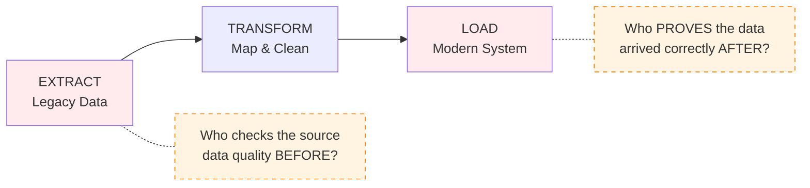
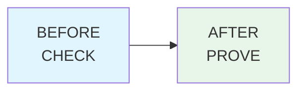
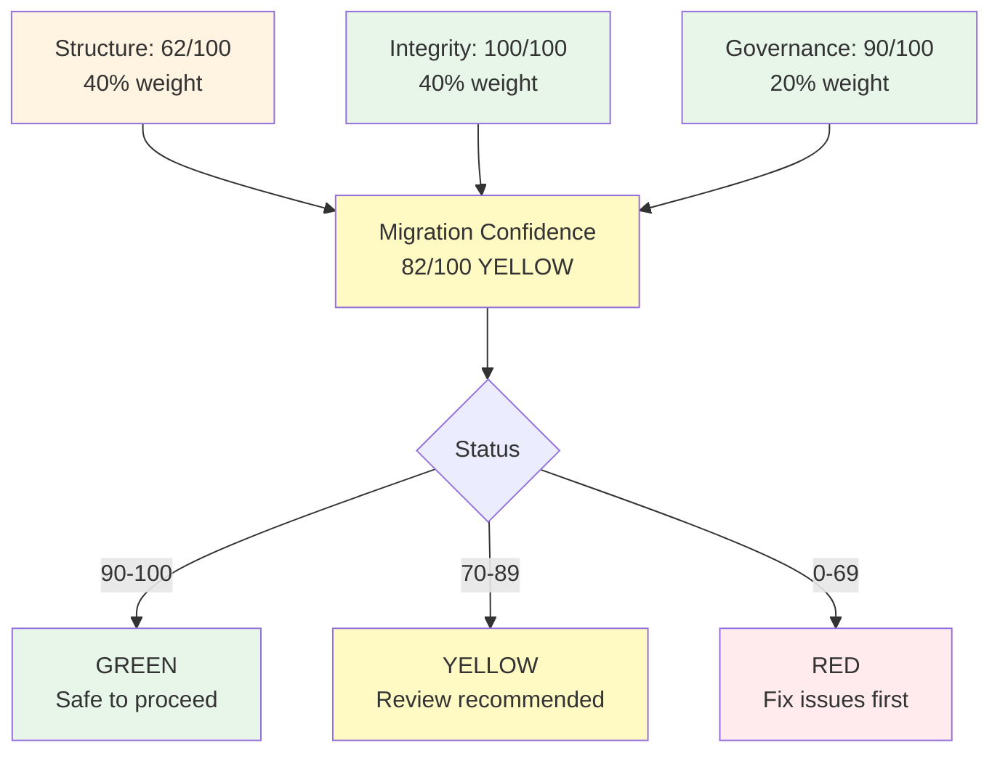
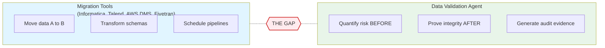
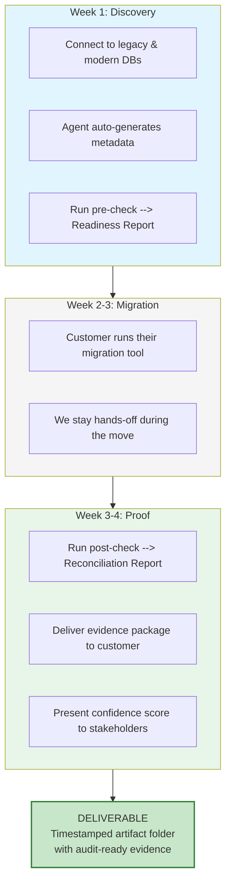
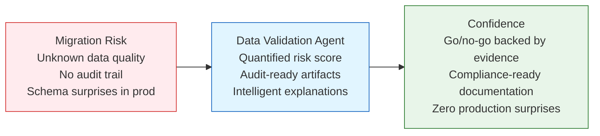

# Data Validation Agent
## Value Proposition Deck

---

## Slide 1: The Problem

### Data Migration Failures Cost Millions

- **70%** of migration projects experience data quality issues
- **$15M** average annual cost of bad data (Gartner)
- **1 in 3** migrations result in downtime or data loss

| What happens today | Impact |
|---|---|
| Schema mismatches found in **production** | 4-8 hours downtime, rollback |
| PII fields (SSNs, bank accounts) migrate unmasked | Compliance violation, $250K+ fine |
| Orphan records silently break reports | Wrong benefit calculations, claimant complaints |
| "Did all rows make it?" answered with **gut feel** | No audit trail, failed SOC 2 reviews |

**Root cause**: Migration tools handle the *move*. Nobody owns the *proof*.

---

## Slide 2: The Gap

### Migration tools move data. Nobody validates it.



**Real examples from legacy-to-cloud migrations:**

| Risk | Example | Cost if Missed |
|---|---|---|
| Column renamed | `cl_fnam` mapped to wrong target | 4 hrs downtime, delayed benefit payments |
| PII exposed | `cl_ssn` migrated without hashing | $250K fine + reputation damage |
| Orphan claims | Claims referencing non-existent `cl_recid` | Broken reports, incorrect benefit calculations |

**Without validation, these are discovered after go-live.**

---

## Slide 3: The Solution

### BEFORE / AFTER Validation with Zero Configuration



| | BEFORE Migration | AFTER Migration |
|---|---|---|
| **Purpose** | Detect risk | Prove integrity |
| **Checks** | Schema diffs, PII detection, data quality | Row counts, checksums, referential integrity |
| **Output** | Readiness report + risk score | Reconciliation proof |
| **Time** | ~30 seconds | ~45 seconds |

**Zero manual configuration** -- metadata auto-generated from database schemas in **2 seconds** (replaces 4-6 hours of manual work).

```bash
# One-time setup: auto-generates validation schemas + RAG metadata
python3 main.py --generate-metadata --no-interactive
```

---

## Slide 4: How It Works

### Two Commands. Auto-Generated Metadata. Full Evidence.

```bash
# 1. Pre-check (before migration)
python main.py --phase pre --dataset claimants

# 2. Proof (after migration)
python main.py --phase post --dataset claimants
```

**COBOL-to-modern schema diff (auto-detected):**

```
LEGACY (COBOL)                  MODERN
----------------------------------------------
cl_recid ...................... claimant_id        (rename)
cl_fnam ....................... first_name         (rename)
cl_lnam ....................... last_name          (rename)
cl_ssn ........................ ssn_hash           (rename + hashed)
cl_dob ........................ date_of_birth      (rename)
cl_phon ....................... phone              (rename + type change)
cl_emal ....................... email              (rename)
cl_adr1 ....................... address_line_1     (rename)
cl_city ....................... city               (rename)
cl_st ......................... state              (rename)
cl_zip ........................ zip_code           (rename)
cl_bact ....................... bank_account       (rename, PII flagged)
cl_brtn ....................... bank_routing       (rename, PII flagged)
cl_stat ....................... status             (rename)
cl_rgdt ....................... registration_date  (rename + type change)
cl_dcsd ....................... is_deceased        (rename + type change)
```

**Agent auto-generates** glossary, mappings, and PII flags -- no manual configuration.

---

## Slide 5: Confidence Scoring

### Traffic Light System: Clear Go/No-Go Decisions



**What the customer sees:**
- A confidence score (0-100) with GREEN / YELLOW / RED status
- A markdown report explaining every issue **and why it matters**
- An audit-ready artifact folder they can hand to compliance

**Scoring formula:**
- **Structure (40%)**: Schema compatibility -- are `cl_fnam`, `cl_ssn`, `cl_dob` mapped correctly?
- **Integrity (40%)**: Data accuracy -- did every `cl_recid` make it to `claimant_id`?
- **Governance (20%)**: Compliance -- is `cl_ssn` hashed? Is `cl_bact` masked?

---

## Slide 6: Industry Comparison

### Not "instead of" -- "on top of"



| Capability | Industry Migration Tool | This Agent |
|---|---|---|
| Move data between systems | Yes | No (not its job) |
| Pre-migration risk scoring | No | **Yes -- quantified 0-100** |
| PII detection before migration | No | **Yes -- flags cl_ssn, cl_bact, cl_emal** |
| Post-migration reconciliation | Basic (row count only) | **Deep (rows + checksums + FK + samples)** |
| Explains *why* a schema differs | No | **Yes -- RAG-powered explanations** |
| Audit-ready evidence artifacts | No | **Yes -- MD + CSV + JSON per run** |
| Confidence score with go/no-go | No | **Yes -- GREEN/YELLOW/RED** |
| Setup time | Weeks (connectors, licensing) | **< 5 minutes** |

> "You use Informatica to move the data. You use this agent to **prove** the data moved correctly."

---

## Slide 7: Engagement Model

### Discovery. Migration. Proof.



**Revenue math:**

| | Without Agent | With Agent |
|---|---|---|
| Manual validation effort | 2-3 weeks per migration | 1-2 days (setup, run, present) |
| Schema + metadata setup | 4-6 hours | 2 seconds |
| Total validation cycle | ~3 weeks | ~2 minutes of runtime |
| Saved consultant weeks | -- | Redeployed to **higher-value advisory and remediation work** |

Every issue the agent finds is billable remediation work: schema fixes, PII masking, data cleanup.

---

## Slide 8: The Bottom Line

### Your migration tool moves the data. Our agent proves it moved correctly.



**ROI Summary:**

| Metric | Before | After |
|---|---|---|
| Validation time | 3 weeks manual | 2 minutes automated |
| Schema setup | 4-6 hours | 2 seconds |
| Issues caught | Post-production (expensive) | Pre-migration (cheap) |
| Audit evidence | Scattered notes | Timestamped artifact folder |
| Confidence | Gut feel | Quantified 0-100 score |

**Three reasons to lead with this on every migration engagement:**

1. **Complementary, not competitive** -- works alongside any migration tool the customer already owns
2. **Generates billable findings** -- every issue found is remediation work for your team
3. **Builds trust** -- customers remember the consultant who delivered proof, not promises

---

**Next step**: Pick an upcoming migration engagement and run the agent on the data. The findings will sell themselves.

```bash
./demo.sh   # 10-minute live demo
```

---

*For technical details see ARCHITECTURE.md. For a live demo run `./demo.sh`*
