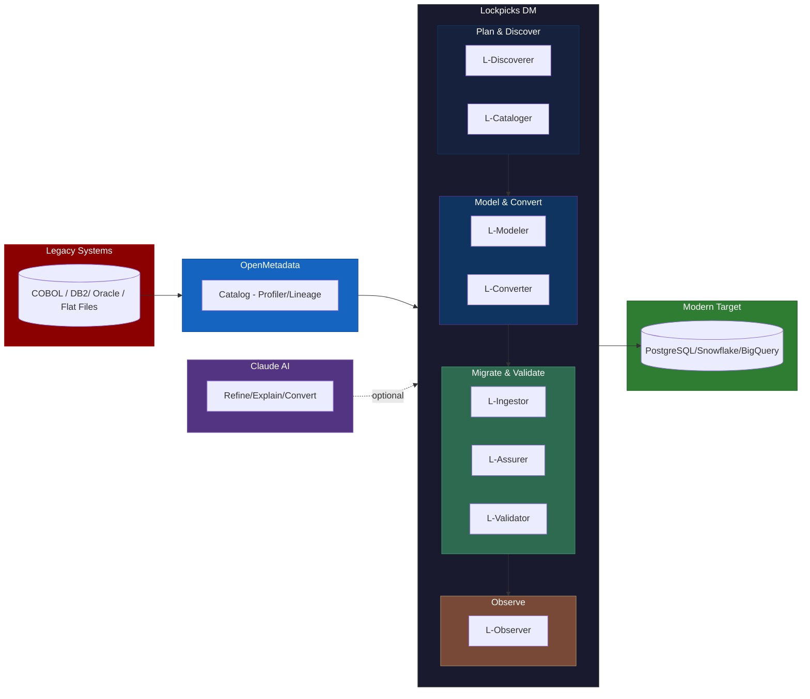

# Data Migration — Brief

## Background

Data migration is a crucial, but delicate, step in transitioning away from a legacy system towards a modern system. Data migration is the process of selecting, preparing, extracting, transferring and validating data from one computer storage system, format, or application to another.

In spite of various industry tooling around data migration, legacy to modern system data migration initiatives are quite complex and leave stakeholders involved with key questions:

- **How might we create higher confidence and trust** in our data migration process or approach?
- **How might we reduce risks** around data compliance and impacts to project timelines?
- **How might we create transparency** in the process, especially for non-technical stakeholders?

---

## Solution: Lockpicks Data Migration

Lockpicks Data Migration is an open, full-lifecycle toolkit that covers every phase of data migration -- from legacy rationalization through post-migration observability. It integrates **OpenMetadata** as the metadata backbone and **Claude AI** as an intelligent co-pilot, while keeping every step auditable, deterministic-first, and pluggable.

Unlike proprietary migration suites, Lockpicks is built on open standards (OpenMetadata, pluggy hooks) and follows a **deterministic-first, AI-second** principle: rule engines produce complete, working output at every stage; AI refines but is never required.

---

## Data Migration Lifecycle

Each phase maps to a specific tool in Lockpicks DM:

### Data Discovery

Collect legacy data sources, schemas along with glossary (with descriptions, SME notes). Identify data worth migrating vs. "dark data" that should be archived.

- Data flow across interfaces, data lineage and profiling
- Actors or stakeholders for communications, decision support
- Migration scope rationalization (which tables to include/exclude)

**Industry Tool:** OpenMetadata (catalog, profiling, glossary, lineage, PII auto-tagging)

**Lockpicks Tools:**

| Tool | CLI Command | What It Does |
|------|-------------|-------------|
| **L-Discoverer** | `dm rationalize` | Analyzes OM data catalog + query activity logs to score table relevance (0-100). Identifies dark data, unused tables, duplicate datasets. Recommends which tables to migrate, archive, or decommission. Reduces migration scope. |
| **L-Cataloger** | `dm discover --enrich` | Pulls OM catalog (schemas, profiling stats, glossary terms, PII tags, lineage) into an enriched `glossary.json` with confidence scores. OM-backed entries get confidence 1.0 vs 0.3 from pattern inference. |

### Data Modeling

Database schema design for the modern target system, informed by legacy data patterns and domain requirements.

- Data patterns and cardinality analysis
- Normalized schema design from denormalized legacy tables
- Business logic complexity assessment
- Domain-driven modeling (DDD) for business-logic-heavy legacy systems

**Lockpicks Tool:**

| Tool | CLI Command | What It Does |
|------|-------------|-------------|
| **L-Modeler** | `dm generate-schema` | Analyzes column prefixes, OM profiling cardinality, and functional dependencies to propose entity decomposition. Generates normalized PostgreSQL DDL with profiling-driven type optimization, constraint inference, PII handling (hash/archive/encrypt), and OM glossary comments. Produces transform skeletons and diff reports. Target platform is pluggable (PostgreSQL built-in; Snowflake, BigQuery via adapter plugins). |

**AI Refinement:** After deterministic generation, the user can refine the DDL with Claude AI -- either via built-in `--ai-refine` flag (calls Claude API) or by copying the generated DDL + glossary into Claude chat manually. Claude suggests indexes, partitioning strategies, naming improvements, and edge cases the rule engine missed.

### Data Governance

PII/PHI data tagging, data modification controls, and audit trails across transformation pipelines.

- PII detection from OM auto-classification tags + keyword pattern matching (45+ patterns including COBOL abbreviations)
- Data modification controls via mapping types: `rename`, `transform`, `archived`, `removed`
- Audit trails via timestamped artifact folders with markdown reports, JSON logs, and confidence scores

**Lockpicks Tools:** Governance is embedded across multiple phases:
- **L-Cataloger** detects PII at discovery time via OM tags + pattern matching
- **L-Modeler** applies PII handling rules (SSN -> SHA-256 hash, bank accounts -> archived, email -> encrypt annotation)
- **L-Assurer** enforces governance gates (naming conventions, null thresholds, required fields, archived field leakage detection)

### Data Migration & Transformation

ELT/ETL pipeline generation, legacy code translation, and orchestrated data movement.

- Legacy SQL/ETL code conversion to modern platform code
- Metadata-driven migration orchestration with dependency ordering
- CDC and incremental load strategies for large tables

**Lockpicks Tools:**

| Tool | CLI Command | What It Does |
|------|-------------|-------------|
| **L-Converter** | `dm convert` | Two-pass code translation: **Pass 1** (deterministic) uses a sqlglot-based rule engine to translate legacy SQL syntax, types, and functions (~80% coverage). **Pass 2** (AI) sends the result to Claude API for semantic review, performance optimization, and edge case handling. Supports Oracle PL/SQL, DB2 SQL, Informatica mappings. Manual fallback generates a prompt file for users without API access. |
| **L-Ingestor** | `dm ingest` | Generates dependency-ordered migration plans from FK relationships, OM lineage, and normalization plans. Executes table loads with pluggable strategies (full load, incremental, CDC, or external delegation to Airbyte/dbt). Tracks migration state with resume-on-failure. Auto-validates each table post-load. |

### Data Compliance

PII flagging, leaked column detection, and transformation compliance verification.

- Pre-migration PII exposure detection
- Archived field leakage gates (PCI/HIPAA regulated fields must NOT appear in modern schema)
- Unmapped column detection (modern columns with no source mapping)
- Profile-based risk assessment (NULL->NOT NULL conflicts, value range violations)

**Lockpicks Tool:**

| Tool | CLI Command | What It Does |
|------|-------------|-------------|
| **L-Assurer** | `dm validate --phase pre` | 6 pre-migration validators: schema diff, Pandera type checks, governance (PII + naming + nulls + required fields), OM profiling risk detection, ETL test generation, and plugin-provided cross-field anomaly rules. Produces a 0-100 confidence score with GREEN/YELLOW/RED status. |

### Data Quality

Data transfer metrics, integrity constraints, and source-vs-target reconciliation.

- Row count matching (normalization-aware for 1:N decomposed tables)
- Column-level checksums and cell-level comparison
- Referential integrity verification (auto-generated from normalization plan)
- Business aggregate validation (configurable tolerance)
- Encoding validation (EBCDIC -> UTF-8)
- Post-migration pipeline monitoring and drift detection

**Lockpicks Tools:**

| Tool | CLI Command | What It Does |
|------|-------------|-------------|
| **L-Validator** | `dm validate --phase post` | 9 post-migration validators: row count, checksums, FK integrity, format-aware sample comparison, business aggregates, archived leakage, unmapped columns, normalization integrity, and encoding checks. Cell-level comparison at scale for critical tables. |
| **L-Observer** | `dm observe` | Post-migration pipeline monitoring: schema drift detection, volume anomaly alerts, data freshness checks, null spike detection, value distribution shift, FK integrity monitoring. Configurable alert channels (Slack, email). Baseline comparison against post-validation snapshot. |

---

## Confidence Scoring

Every validation run produces a quantified confidence score that answers the stakeholder question: **"Is this migration safe?"**

| Score | Status | Meaning | Action |
|-------|--------|---------|--------|
| 90-100 | GREEN | Safe to proceed | Go ahead |
| 70-89 | YELLOW | Review recommended | Check warnings |
| 0-69 | RED | Risk detected | Fix issues first |

**Formula:** `confidence = (0.4 x structure) + (0.4 x integrity) + (0.2 x governance)`

This scoring creates transparency for non-technical stakeholders: a single number and traffic-light status that communicates migration readiness without requiring them to read technical reports.

---

## AI Integration: Deterministic-First, AI-Second

A key design principle: **every tool produces complete, working output from deterministic rule engines first.** Claude AI refines but is never required.

| Tool | Deterministic Output | AI Refinement (Optional) |
|------|---------------------|------------------------|
| L-Discoverer | Table relevance scores from OM metrics | Claude explains WHY tables are low-value |
| L-Modeler | DDL from profiling stats + normalization rules | Claude suggests indexes, partitioning, naming |
| L-Converter | SQL translation from rule engine (~80% coverage) | Claude handles complex semantics, performance |
| L-Observer | Drift alerts from baseline comparison | Claude explains root cause, suggests remediation |

**Two integration modes:**
1. **Built-in** (`--ai-refine`): Calls Claude API programmatically via Anthropic SDK
2. **Manual fallback**: Generates a prompt file (`*_prompt.md`) with context for pasting into Claude chat

---

## Lockpicks Data Migration -- Component Model

| Phase | Tool | CLI | Key Metric |
|-------|------|-----|------------|
| Plan | L-Discoverer | `dm rationalize` | Scope reduction % |
| Discover | L-Cataloger | `dm discover --enrich` | Glossary confidence |
| Model | L-Modeler | `dm generate-schema` | Schema confidence |
| Convert | L-Converter | `dm convert` | Conversion coverage % |
| Migrate | L-Ingestor | `dm ingest` | Tables migrated / total |
| Pre-check | L-Assurer | `dm validate --phase pre` | Confidence 0-100 |
| Post-check | L-Validator | `dm validate --phase post` | Confidence 0-100 |
| Monitor | L-Observer | `dm observe` | Drift alerts |

---

## Use Cases

- State government legacy system modernization (Medicaid, unemployment insurance, grants)
- COBOL/DB2 mainframe to cloud PostgreSQL migrations
- Enterprise data warehouse consolidation (Oracle/Teradata to Snowflake/BigQuery)
- Compliance-driven migrations requiring PII/HIPAA/PCI audit trails
- Any project where stakeholders need quantified confidence in migration quality

### Related Projects

- Alaska DOH Medicaid
- Simpler Grants
- NJ Data

---

## Proof of Concept: LOOPS NJ

As a POC to understand the challenges and engender further exploration of this space, we have implemented Lockpicks DM against a legacy unemployment insurance system (LOOPS NJ -- COBOL, DB2) schema migration scenario.

**The three problems it addresses:**

1. **Discovery** -- Legacy schemas use cryptic names (`cl_fnam`, `bp_payam`, `cm_wkamt`) with no documentation. Nobody knows what half the columns mean.
2. **Schema Design** -- Designing a normalized modern schema from a denormalized legacy table is manual, error-prone, and slow. PII handling and compliance rules are applied ad-hoc.
3. **Validation** -- After migration, there's no systematic way to prove data integrity. Teams rely on spot-checks and hope.

**The pipeline (currently implemented stages):**

| Stage | What Happens | Tool |
|-------|-------------|------|
| Catalog | OM crawls legacy DB, profiles every column, auto-tags PII | OpenMetadata |
| Curate | Data stewards add glossary terms, descriptions, lineage in OM | OpenMetadata UI |
| Discover | DM pulls OM catalog into enriched glossary.json with confidence scores | `dm discover --enrich` |
| Normalize | Analyzes column prefixes, cardinality, FDs to propose entity decomposition | `dm generate-schema` |
| Generate | Produces PostgreSQL DDL with proper types, constraints, PII handling, comments | `dm generate-schema` |
| Review | Human reviews generated DDL, then optionally refines with Claude AI | Manual + Claude |
| Pre-check | Validates schema readiness, profiling risks, governance compliance | `dm validate --phase pre` |
| Migrate | Run your ETL (Airbyte, custom scripts, etc.) | External |
| Post-check | Verifies row counts, checksums, FK integrity, sample comparison, aggregates | `dm validate --phase post` |
| Prove | Generates migration proof report combining pre + post results | `dm prove` |

**POC results (LOOPS NJ claimants table):**

- 17 legacy columns (COBOL-style) -> 3 normalized modern tables (claimants + addresses + status lookup)
- PII handling: SSN hashed (HIPAA), bank accounts archived (PCI-DSS), email/phone encrypted
- Pre-migration score: 87/100 YELLOW (profile risks flagged)
- Post-migration score: 94/100 GREEN (data integrity verified)
- Migration proof: 90.5/100 GREEN (audit-ready report generated)

---

## What's Next: Full Lifecycle Roadmap

The POC validates the discovery + schema generation + validation phases. The roadmap extends coverage to the full migration lifecycle:

| Phase | Target | Key Deliverable |
|-------|--------|----------------|
| **Phase 1** | Target adapter interface | Pluggable DDL generation (PostgreSQL built-in, Snowflake/BigQuery via plugins) |
| **Phase 2** | L-Discoverer | Migration scope rationalization via OM query activity analysis |
| **Phase 3** | L-Converter | Deterministic + AI code translation (legacy SQL -> modern platform) |
| **Phase 4** | L-Ingestor | Metadata-driven migration orchestration with state tracking |
| **Phase 5** | L-Observer | Post-migration pipeline monitoring and drift detection |
| **Phase 6** | AI layer | Claude API integration across all tools |
| **Phase 7** | Validator enhancements | ETL test generation, cell-level comparison, encoding checks |

Phases 2-5 can proceed in parallel after Phase 1.

---

## Key Differentiators

1. **OpenMetadata-native** -- built on an open data catalog standard with 70+ connectors, not a proprietary scanner
2. **Deterministic-first, AI-second** -- rule engines produce complete working output at every stage; Claude AI refines but is never required
3. **Schema generation from legacy metadata** -- auto-generates normalized target schemas from OM profiling data, a capability not commonly found in migration tooling
4. **Quantified confidence scoring** -- 0-100 migration readiness score with GREEN/YELLOW/RED status creates transparency for non-technical stakeholders
5. **Open and pluggable** -- 19 extension hooks for customization; domain-specific rules live in plugins, not hardcoded in the toolkit
